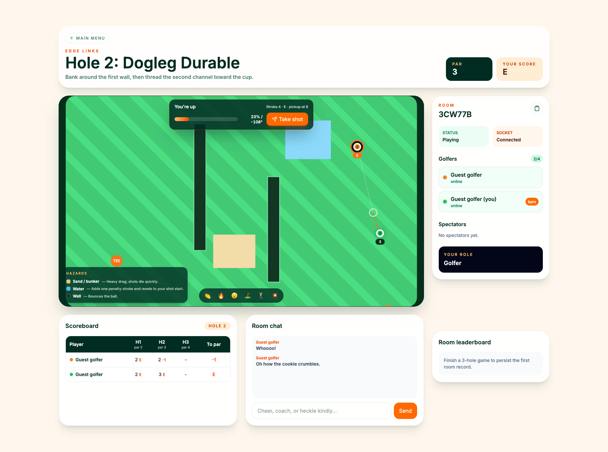
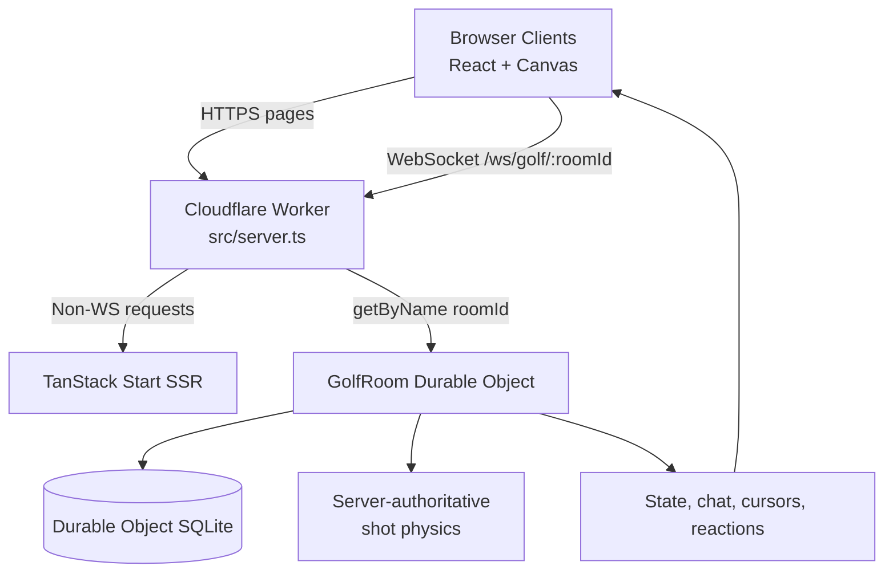

# Cloudflare Multiplayer 2D Golf Demo

[](LICENSE)

> A real-time 2D mini-golf demo showing how Cloudflare Durable Objects can coordinate authoritative multiplayer game state at the edge.

**Live Demo:** [multiplayer-mini-golf.cloudflare.app](https://multiplayer-mini-golf.cloudflare.app)

Fallback demo URL: [cloudflare-multiplayer-golf-demo.dwarven.workers.dev](https://cloudflare-multiplayer-golf-demo.dwarven.workers.dev/)



## Table of Contents

- [Architecture](#architecture)
- [Features](#features)
- [Tech Stack](#tech-stack)
- [Prerequisites](#prerequisites)
- [Getting Started](#getting-started)
- [Configuration](#configuration)
- [Usage](#usage)
- [Project Structure](#project-structure)
- [Verification](#verification)
- [Deployment](#deployment)
- [Contributing](#contributing)
- [License](#license)

## Architecture



Each room code maps to one `GolfRoom` Durable Object instance. The Worker only routes WebSocket upgrades to the Durable Object; all other requests go to TanStack Start for SSR and assets. The Durable Object stores room state in SQLite, validates turns, runs deterministic shot physics, and broadcasts synchronized updates to every connected browser.

## Features

- Real-time rooms with one Durable Object per room code.
- Up to four active golfers, with additional users joining as spectators.
- Hibernatable WebSockets for efficient room fanout.
- Durable Object SQLite persistence for players, chat, strokes, and leaderboard entries.
- Server-authoritative shot simulation so every client sees the same result.
- Live cursors, room chat, emoji reactions, scoring, pickups, hazards, and leaderboard state.
- Workers-native integration tests using `@cloudflare/vitest-pool-workers`.

## Tech Stack

| Layer | Technology |
|-------|------------|
| Runtime | Cloudflare Workers |
| Stateful coordination | Durable Objects, hibernatable WebSockets, Durable Object SQLite |
| Framework | TanStack Start, TanStack Router |
| UI | React 19, Canvas, Tailwind CSS v4 |
| Build tooling | Vite, TypeScript, Wrangler |
| Testing | Vitest, `@cloudflare/vitest-pool-workers` |

## Prerequisites

- Node.js 20 or newer.
- npm.
- A Cloudflare account if you want to deploy your own copy.
- Wrangler authentication for deployment: `npx wrangler login`.

## Getting Started

### Clone the Repository

```bash
git clone https://github.com/Gryczka/cloudflare-multiplayer-2d-golf-demo.git
cd cloudflare-multiplayer-2d-golf-demo
```

### Install Dependencies

```bash
npm install
```

### Run Locally

```bash
npm run dev
```

Open `http://127.0.0.1:3000`.

To test multiplayer locally, open the same room URL in multiple browser windows or browser profiles.

## Configuration

No environment variables or secrets are required for local development.

The important Cloudflare configuration lives in `wrangler.jsonc`:

- `main`: `src/server.ts`, the custom Worker entrypoint.
- `durable_objects.bindings`: exposes the `GOLF_ROOM` binding.
- `migrations`: registers `GolfRoom` as a SQLite-backed Durable Object class.
- `observability.enabled`: enables Workers observability for deployed copies.

An empty `.dev.vars.example` is included so you have a safe place to document future local-only variables if you extend the demo.

## Usage

1. Enter a display name.
2. Create a room or join an existing room code.
3. Start the game from the lobby.
4. Drag from your ball to aim and adjust power.
5. Take a shot. The browser sends only `{ angle, power }`; the Durable Object computes the authoritative trajectory.
6. Watch every connected client receive the same shot animation, score update, chat, cursor, and reaction state.

## Project Structure

```text
cloudflare-multiplayer-2d-golf-demo/
+-- public/                    # PWA manifest and static assets
+-- src/
|   +-- components/            # React UI and canvas rendering components
|   +-- durable-objects/       # GolfRoom Durable Object implementation
|   +-- game/                  # Shared course, physics, scoring, and protocol types
|   +-- hooks/                 # Browser WebSocket client hook
|   +-- routes/                # TanStack Router file routes
|   +-- tests/                 # Workers runtime and physics tests
|   +-- server.ts              # Worker entrypoint and WebSocket router
|   +-- test-worker.ts         # Minimal Worker entry used by Vitest
+-- docs/screenshots/demo.png  # README hero screenshot
+-- wrangler.jsonc             # Cloudflare Worker and Durable Object config
+-- vite.config.ts             # Vite, TanStack Start, Tailwind, and Cloudflare plugins
+-- vitest.config.ts           # Workers runtime test config
+-- worker-configuration.d.ts  # Generated Cloudflare binding types
```

## Verification

```bash
npm run generate-routes
npm run cf-typegen
npm test
npx tsc --noEmit
npm run build
```

## Deployment

```bash
npm run deploy
```

Wrangler deploys the Worker defined by `src/server.ts` and applies the Durable Object SQLite migration in `wrangler.jsonc`.

## Contributing

Contributions are welcome. Please read [CONTRIBUTING.md](CONTRIBUTING.md) and follow the [Code of Conduct](CODE_OF_CONDUCT.md).

## License

This project is licensed under the MIT License. See [LICENSE](LICENSE) for details.
